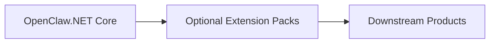

# Architecture Boundaries

OpenClaw.NET is a NativeAOT-friendly agent runtime and gateway for local and self-hosted .NET agent workloads. This page defines the intended project boundaries so contributors can decide what belongs in core, what belongs in the gateway, and what should stay in optional extension packs or downstream products.

## OpenClaw.NET Core

Core owns the stable runtime contracts and minimal behavior required to run agent workloads safely.

Core includes:

- agent runtime contracts and loop behavior
- session and memory abstractions
- tool execution contracts
- runtime hooks
- safety and diagnostics primitives
- source-generated serialization paths
- NativeAOT-friendly runtime behavior

Core should stay small, reusable, and compatible with the strict AOT lane.

## Gateway

The gateway is the local or self-hosted host around the runtime.

Gateway responsibilities include:

- local/self-hosted process hosting
- HTTP surfaces
- OpenAI-compatible endpoints
- MCP endpoints
- websocket surfaces
- admin, health, and diagnostics routes
- configuration, startup, and public-bind posture checks

The gateway can compose optional surfaces, but it should not hide unsupported runtime modes or silently load extensions that require a different compatibility lane.

## Optional Extension Surfaces

Optional surfaces should be explicit, documented, and isolated from the core path when they add provider, adapter, plugin, or deployment-specific weight.

Examples include:

- browser tools
- plugin bridge
- channel adapters
- model providers
- memory providers
- workflow backends
- payment plugins
- industrial adapters

Extensions should fail fast when unsupported in the active runtime mode.

## AOT/JIT Boundary

Core should remain AOT-friendly.

JIT, dynamic, or plugin-heavy surfaces should be explicit and optional. They should not add hidden reflection, dynamic loading, or provider SDK requirements to the default NativeAOT-friendly path.

Unsupported modes should fail fast with clear diagnostics rather than partially loading.

## What Belongs In Core

Core changes should focus on:

- stable abstractions
- runtime contracts
- security posture
- diagnostics
- minimal runtime behavior
- compatibility-safe primitives used by multiple surfaces

Core should not become a product-specific workflow engine or a vendor-specific integration bundle.

## What Should Not Enter Core

The following should stay out of core:

- company-specific product logic
- customer-specific workflows
- vendor-specific defaults
- heavy optional integrations without a clear boundary
- proprietary business rules
- closed commercial UX assumptions

These may belong in optional extension packs, separate adapters, examples, docs, or downstream products.

## Industrial Pack Boundary

Industrial Pack work should be reusable infrastructure, adapters, examples, templates, and docs.

Appropriate Industrial Pack work includes:

- reusable industrial abstractions
- protocol adapters
- simulated machine examples
- telemetry ingestion contracts
- alert classification samples
- maintenance-ticket samples
- shift-summary samples
- diagnostics and observability examples
- deployment guidance

Industrial Pack work should not include proprietary customer deployments, product-specific digital employee workflows, vendor-exclusive defaults, or closed commercial UX.

## Runtime Flow

## Extension And Product Layers

## Review Rule

When a change is hard to place, reviewers should ask:

- Does this need to be a stable runtime contract?
- Does this affect gateway safety, public-bind behavior, or operator diagnostics?
- Does this preserve NativeAOT compatibility?
- Does this belong in an optional extension instead of core?
- Is this reusable infrastructure or product-specific logic?
- Does this preserve vendor neutrality?
