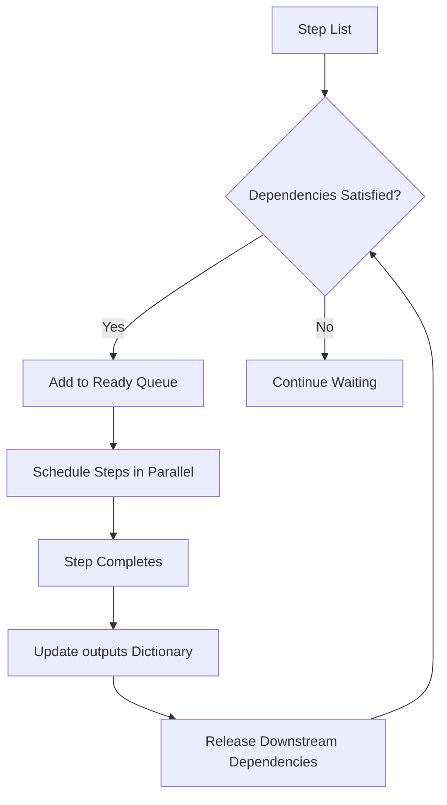
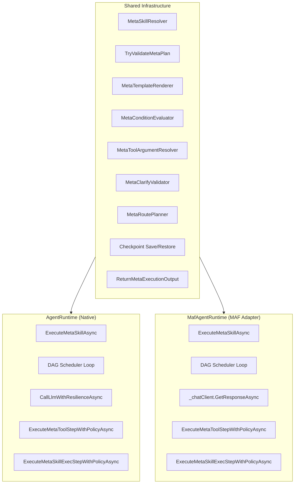
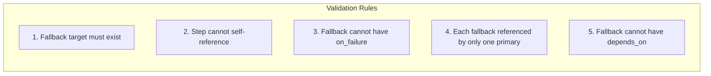
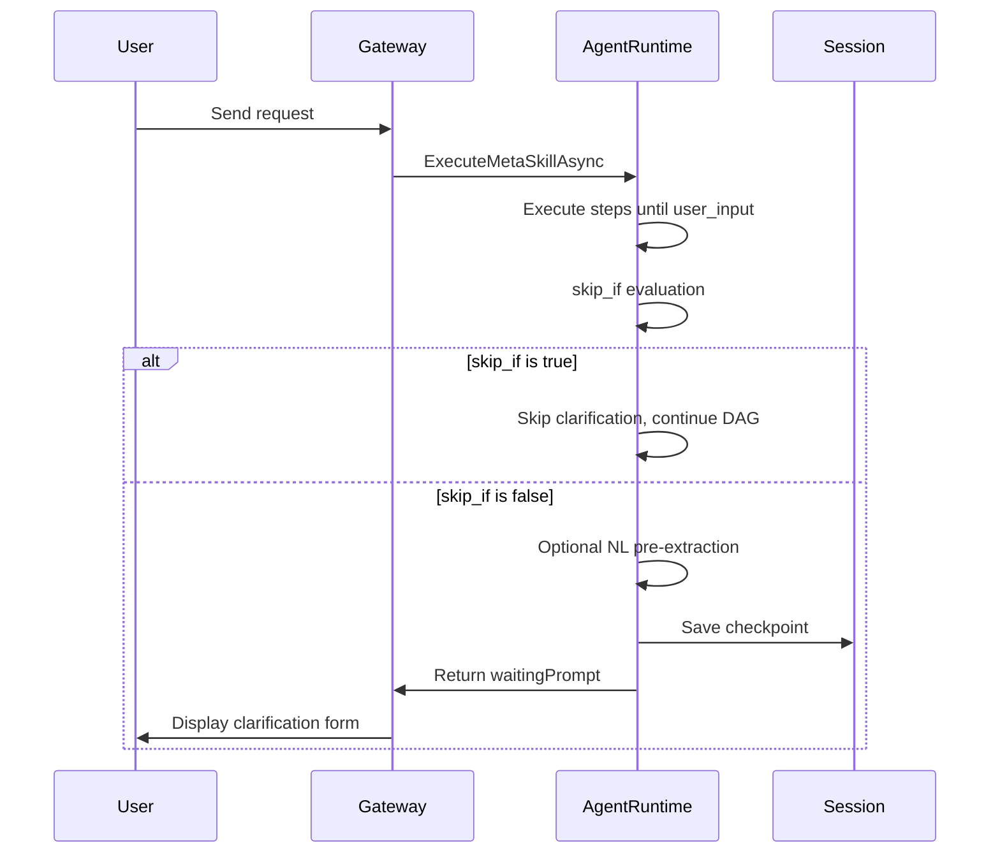
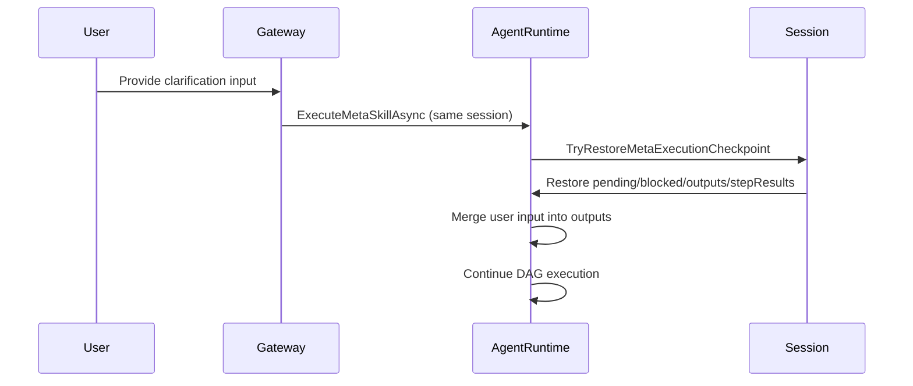
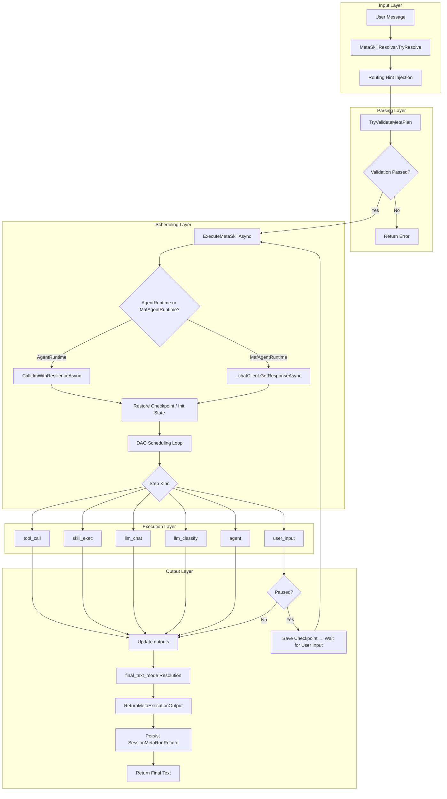

# MetaSkill Orchestration Architecture

MetaSkills are OpenClaw.NET's mechanism for composing multiple skills — and
arbitrary LLM/tool calls — into multi-step, dependency-aware execution plans.
Unlike regular skills that inject a system prompt and let the agent self-direct,
a MetaSkill declares an explicit DAG of steps, each with a specific execution kind,
and the orchestrator drives that plan to completion with parallel scheduling,
fault tolerance, and human-in-the-loop pausing.

> For a feature overview, see [`meta-skills.md`](meta-skills.md). For the user guide,
> see [`meta-skill-user-guide.md`](meta-skill-user-guide.md).
> A Chinese translation is available at [`zh-CN/meta-skill-orchestration.md`](zh-CN/meta-skill-orchestration.md).

---

## Core Type System

The MetaSkill subsystem is built on a set of immutable types that provide
compile-time contracts between the parser, scheduler, executors, and persistence
layer. All modules communicate through the frozen records/classes defined in
`SkillModels.cs`.

### MetaSkillStepDefinition — The Fundamental Unit of the Execution DAG

Each step represents one node in the execution DAG, carrying the following key
fields:

| Field | Type | Description |
| --- | --- | --- |
| `Id` | `string` | Unique identifier within the plan |
| `Kind` | `string` | Step execution kind (`agent`, `llm_chat`, `llm_classify`, `tool_call`, `skill_exec`, `user_input`) |
| `Skill` | `string?` | Delegated skill name (required for `agent` / `skill_exec` kinds) |
| `Tool` | `string?` | Delegated tool name (required for `tool_call` kind) |
| `DependsOn` | `IReadOnlyList<string>` | Upstream dependency step IDs, forming DAG edges |
| `When` | `string?` | Jinja conditional expression controlling whether this step executes |
| `Routes` | `IReadOnlyList<MetaRouteDefinition>` | Conditional route definitions for branching to other steps |
| `OutputChoices` | `IReadOnlyList<string>` | Allowed output values for classification steps |
| `ToolAllowlist` | `IReadOnlyList<string>` | Tool access allowlist |
| `OnFailure` | `string?` | Substitute step ID to execute on failure |
| `TimeoutSeconds` | `int?` | Step-level timeout |
| `Retry` | `MetaStepRetryPolicy` | Retry policy (`MaxAttempts` + `BackoffMs`) |
| `Clarify` | `MetaClarifySchema?` | User input clarification form definition |
| `OutputContract` | `MetaStepOutputContract` | Step output validation contract (`Format` + `RequiredProperties`) |
| `SkillExecEntrypoint` / `SkillExecArgs` / `SkillExecParseMode` | various | Entrypoint, arguments, and output parse mode for `skill_exec` subprocess execution |

### SkillDefinition — Complete Runtime Representation of a Skill

`SkillDefinition` is the fully loaded skill definition. Fields directly relevant to
MetaSkills include:

- `Kind`: Set to `SkillKind.Meta` to identify a MetaSkill
- `Triggers`: List of natural-language trigger phrases
- `MetaPriority`: MetaSkill match priority
- `FinalTextMode`: Final text mode (`auto`, `raw`, `structured`, `step:<id>`)
- `Composition`: `MetaSkillComposition` instance containing the step list and composition-level `ToolArgsJson`

### MetaClarifySchema — Clarification Form Definition

`user_input` steps use `Clarify` to define interactive forms:

```yaml
clarify:
  mode: form              # chat or form
  nl_extract: true        # whether NL pre-extraction is enabled
  fields:                 # form field list
    - name: topic
      type: string
      required: true
      min_length: 3
    - name: priority
      type: enum
      options: [low, medium, high]
      default: "medium"
  cancel_words: [cancel, 取消]
  timeout_seconds: 300
  skip_if: "outputs.auto_approve == '1'"
```

Supported field types: `string`, `enum`, `integer`, `boolean`. Each field can
configure required status, default value, enum options, min/max length, and
numeric bounds.

### Auxiliary Types

| Type | Description |
| --- | --- |
| `MetaRouteDefinition` | Conditional route with `When` (Jinja expression) and `To` (target step ID) |
| `MetaStepRetryPolicy` | Retry policy: `MaxAttempts` (including initial attempt), `BackoffMs` (retry interval) |
| `MetaStepOutputContract` | Output validation contract: `Format` (`text` / `json`), `RequiredProperties` |
| `MetaExecutionContext` | Execution context: holds `input` and `outputs` dictionary for template rendering |
| `MetaStepExecutionResult` | Per-step execution result: `StepId`, `Kind`, `Status`, `FailureCode`, `ElapsedMs`, `Continued` |

---

## Plan Parsing and DAG Validation

Before execution begins, the parser transforms the `SKILL.md` `composition` block
into a validated list of step definitions. Validation occurs at multiple levels,
ensuring that by the time the scheduler sees a plan, it has already been proven
acyclic, internally consistent, and self-contained.

### Parsing Pipeline

```
SKILL.md (YAML frontmatter)
  → SkillLoader parses composition.steps
    → Each step constructs a MetaSkillStepDefinition
      → TryValidateMetaPlan() DAG structural validation
        → Pass → Enter ExecuteMetaSkillAsync scheduling loop
        → Fail → Return structured error
```

### Structural Validation Rules

`TryValidateMetaPlan` performs the following checks (located in `AgentRuntime.cs`):

1. **Unique IDs**: Every step's `Id` must be unique within the plan
2. **Kind validity**: `Kind` must be one of the six supported types
3. **Skill references**: `agent` / `skill_exec` steps must declare `skill` and the referenced skill must exist
4. **Dependency references**: Every ID in `depends_on` must reference another step in the plan
5. **Acyclicity check**: Detects cycles in the DAG (topological sort implementation)
6. **OnFailure validation** (5 engineering constraints):
   - Fallback target must exist
   - Step cannot self-reference
   - Fallback cannot have `on_failure` (no chains)
   - Each fallback can only be referenced by one primary
   - Fallback cannot have `depends_on`
7. **MetaSkill nesting prohibition**: A MetaSkill cannot delegate to another MetaSkill (`TryValidateMetaPlan` rejects `kind: meta` delegated skills)
8. **Route target validation**: `to` fields in `routes` must reference steps that exist in the plan

```csharp
// Located in AgentRuntime.cs
if (!TryValidateMetaPlan(steps, LoadedSkills, out var validationError))
    return ReturnMetaExecutionOutput(session, metaSkill,
        finalText: null, stepResults: [],
        validationError, preserveCheckpoint: false);
```

### Template Rendering

The `with`, `tool_args`, and `when` fields in steps support Jinja template syntax.
Templates are rendered through `MetaTemplateRenderer` using the `Jinja2.NET` engine,
with OpenSquilla-compatible filters: `xml_escape`, `slugify`, `truncate`, `tojson`.

Template-accessible context variables:

- `{{ input }}`: the user's original input
- `{{ outputs.<step_id> }}`: output from a completed step
- `{{ inputs.workspace_dir }}`: workspace directory path

---

## Step Execution Kinds

The orchestrator dispatches to six distinct execution paths based on `Kind`. Each
kind has different execution cost, tool access, and behavioral contracts. This
design lets plan authors select the minimum-cost executor for each step rather
than defaulting to a full sub-agent for everything.

| Kind | Execution Method | Tool Access | LLM Calls | Cost | Use Case |
| --- | --- | --- | --- | --- | --- |
| `agent` | Delegate to another skill's instructions | ✅ Full | ✅ Multi-turn | Highest | Open-ended reasoning and synthesis |
| `llm_classify` | Force return of one label from a closed set | ❌ | ✅ Single | Lowest LLM | Routing classifiers |
| `llm_chat` | Bounded LLM generation | ❌ | ✅ Single | Low LLM | Bounded synthesis without tool spawning |
| `tool_call` | Direct tool invocation | ✅ Direct | ❌ | Lowest | Deterministic side-effects (memory_save, file writes) |
| `skill_exec` | Subprocess execution | ✅ Subprocess | ❌ | Low | CLI-wrapped skill execution |
| `user_input` | Pause for human input | ❌ (optional NL extract) | ❌ | Pause overhead | Human-in-the-loop clarification forms |

### `agent` — Full Sub-Agent

`agent` is the default kind. It injects the referenced skill's `SKILL.md` instructions
as the system prompt to generate a full agent response. This kind allows the model
to perform multi-turn reasoning and tool calls.

### `llm_classify` — Constrained Classification

Forces the model to return exactly one label from `output_choices`. Used for routing
and triage:

```yaml
- id: classify
  kind: llm_classify
  output_choices: [BUG, FEATURE, QUESTION]
  with:
    text: "{{ input | truncate(512) }}"
```

### `llm_chat` — Bounded Generation

Performs a single LLM call for bounded synthesis with no tool loop. Suitable for
intake normalization, compact drafting, or lightweight synthesis.

### `tool_call` — Direct Tool Execution

Bypasses the LLM entirely and invokes a registered tool handler with Jinja-rendered
arguments. `tool_allowlist` restricts accessible tools; `metadata.capabilities`
provides additional capability-level gating.

### `skill_exec` — Subprocess Execution

Runs a skill's declared `entrypoint` manifest as a subprocess. Supports `json`,
`text`, and `lines` parse modes. Arguments are Jinja-rendered before passing.

### `user_input` — Human-in-the-Loop Pause

Pauses DAG execution to collect structured user input. See the
[User-Input Pause and Resume](#user-input-pause-and-resume) section for details.

---

## DAG Scheduler

The scheduler is the heart of the execution engine. It consumes the step list in
topological order, dispatching each ready step as an independent task and creating
genuine parallel execution for steps with no shared dependencies.

### Parallel Scheduling Mechanism



The scheduler maintains the following runtime state:

| State | Description |
| --- | --- |
| `pending` | Set of step IDs not yet completed |
| `blocked` | Set of step IDs blocked by conditional routing or failure branches |
| `outputs` | Dictionary mapping step ID → output text |
| `failureAliases` | Failure substitution map (original step ID → substitute step ID) |
| `stepResults` | Accumulated list of per-step execution results |
| `dependentsByStep` | Reverse dependency index (step → set of downstream steps that depend on it) |

### Tool Step Wave Parallelism

`TryExecuteParallelToolWaveAsync` identifies all independent `tool_call` steps
whose dependencies are satisfied and dispatches them in the same scheduling wave
for parallel execution. This optimizes scenarios requiring multiple independent
tool calls.

### Conditional Routing

`MetaRoutePlanner` evaluates `routes` after each step completes. Matching route
conditions block non-matching downstream paths, ensuring execution flows to the
correct branch:

```yaml
- id: classify
  kind: llm_classify
  output_choices: [BUG, FEATURE]
  routes:
    - when: "outputs.classify == 'BUG'"
      to: fix_bug
    - when: "outputs.classify == 'FEATURE'"
      to: design_feature
```

### Runtime Sharing

The DAG engine is shared between `AgentRuntime` (native) and `MafAgentRuntime`
(Microsoft Agent Framework adapter) — both execute MetaSkills identically. All
parity tests pass on both runtimes. See the [Dual-Runtime Architecture](#dual-runtime-architecture)
section for a detailed comparison.

---

## Dual-Runtime Architecture

OpenClaw.NET implements MetaSkill execution across two independent runtimes that
share the same DAG scheduler core, the same validation pipeline, and the same
auxiliary infrastructure — but differ in how they invoke the LLM for model-backed
step kinds (`agent`, `llm_chat`, `llm_classify`).

### Architecture Diagram



### What Is Shared

Both runtimes share a single `IAgentRuntime` interface and delegate to identical
implementations of the following infrastructure:

| Component | Location | Shared? |
| --- | --- | --- |
| Trigger resolution | `MetaSkillResolver.TryResolve` | ✅ Identical |
| Plan validation | `TryValidateMetaPlan` | ✅ Identical |
| DAG scheduler loop | `while (pending.Count > 0)` state machine | ✅ Identical logic, separate copy |
| Template rendering | `MetaTemplateRenderer` (Jinja2.NET) | ✅ Identical |
| Condition evaluation | `MetaConditionEvaluator` | ✅ Identical |
| Tool argument resolution | `MetaToolArgumentResolver` | ✅ Identical |
| Clarify validation | `MetaClarifyValidator` | ✅ Identical |
| Route planning | `MetaRoutePlanner` | ✅ Identical |
| Checkpoint save/restore | `SaveMetaExecutionCheckpoint` / `TryRestoreMetaExecutionCheckpoint` | ✅ Identical |
| Audit persistence | `ReturnMetaExecutionOutput` → `SessionMetaRunRecord` | ✅ Identical |
| Tool invocation | `ExecuteMetaToolStepWithPolicyAsync` via `OpenClawToolExecutor` | ✅ Identical |
| Subprocess execution | `ExecuteMetaSkillExecStepWithPolicyAsync` | ✅ Identical |

### What Differs: LLM Dispatch

The two runtimes diverge in how they invoke the LLM for model-backed step kinds.
This is the **only** architectural difference:

| Step Kind | AgentRuntime (Native) | MafAgentRuntime (MAF) |
| --- | --- | --- |
| `agent` | `ExecuteMetaLlmStepWithPolicyAsync` → `CallLlmWithResilienceAsync` | `ExecuteMetaChatStepWithPolicyAsync` → `_chatClient.GetResponseAsync` |
| `llm_chat` | `ExecuteMetaLlmStepWithPolicyAsync` → `CallLlmWithResilienceAsync` | `ExecuteMetaChatStepWithPolicyAsync` → `_chatClient.GetResponseAsync` |
| `llm_classify` | `ExecuteMetaLlmStepWithPolicyAsync` → `CallLlmWithResilienceAsync` | `ExecuteMetaChatStepWithPolicyAsync` → `_chatClient.GetResponseAsync` |
| `tool_call` | Identical (via `OpenClawToolExecutor`) | Identical (via `OpenClawToolExecutor`) |
| `skill_exec` | Identical (`ExecuteMetaSkillExecStepWithPolicyAsync`) | Identical (`ExecuteMetaSkillExecStepWithPolicyAsync`) |
| `user_input` | Identical checkpoint logic | Identical checkpoint logic |

### AgentRuntime LLM Path

The native runtime calls the LLM through its own resilience wrapper:

```csharp
// AgentRuntime.cs — llm_chat / llm_classify / agent dispatch
var llmResult = await ExecuteMetaLlmStepWithPolicyAsync(
    step,
    token => CallLlmWithResilienceAsync(session, messages, options, turnCtx, token),
    ct);
```

`CallLlmWithResilienceAsync` handles retry, circuit breaking, and provider-level
error recovery directly against the configured LLM provider.

### MafAgentRuntime LLM Path

The MAF adapter calls the LLM through Microsoft Agent Framework's `IChatClient`:

```csharp
// MafAgentRuntime.cs — llm_chat / llm_classify / agent dispatch
var response = await ExecuteMetaChatStepWithPolicyAsync(
    step,
    token => _chatClient.GetResponseAsync(messages, options, token),
    ct);
```

`_chatClient` is a `MafExecutionServiceChatClient` that wraps the MAF AI pipeline,
providing middleware, telemetry, and streaming support. Retry and circuit breaking
are handled by `ExecuteMetaChatStepWithPolicyAsync`, which mirrors
`ExecuteMetaLlmStepWithPolicyAsync` in structure.

### Constructor Wiring

Both runtimes wire MetaSkill execution through `OpenClawToolExecutor`'s
`metaInvokeExecutor` callback at construction time:

```csharp
// AgentRuntime.cs
_metaSkillsEnabled = context.SkillsConfig?.MetaSkill.Enabled ?? true;
toolExecutor = new OpenClawToolExecutor(
    ...,
    metaInvokeExecutor: (session, skillName, input, token)
        => ExecuteMetaSkillAsync(session, skillName, input, token));

// MafAgentRuntime.cs — identical pattern
_metaSkillsEnabled = context.SkillsConfig?.MetaSkill.Enabled ?? true;
_toolExecutor = new OpenClawToolExecutor(
    ...,
    metaInvokeExecutor: (session, skillName, input, token)
        => ExecuteMetaSkillAsync(session, skillName, input, token));
```

When the model calls the `meta_invoke` tool, `OpenClawToolExecutor` routes to
the runtime-specific `ExecuteMetaSkillAsync`, which in turn calls the runtime's
own LLM dispatch methods for model-backed steps.

### Parity Guarantee

All MetaSkill execution paths are covered by parity tests in
`MafAdapterTests.cs` and `AgentRuntimeTests.cs`. The test suite verifies that
both runtimes produce identical `stepResults`, `outputs`, `final_text`, and
`SessionMetaRunRecord` entries for the same MetaSkill plan and inputs.

---

## Failure Handling

### OnFailure Substitute Steps

When a step fails (timeout, tool error, validation failure, LLM exception), the
scheduler first checks whether that step declared an `on_failure` substitute. If it
did, the substitute step is dispatched and its output is mirrored into the failed
step's output slot — downstream `depends_on` links remain satisfied.

```yaml
- id: primary_search
  kind: tool_call
  tool: web_search
  on_failure: fallback_search

- id: fallback_search
  kind: tool_call
  tool: local_search
```

### ContinueOnError

`with.continue_on_error` controls error propagation behavior:

- `false` (default): step failure → terminate entire DAG, return error
- `true`: step failure → record failure result, continue executing subsequent steps

### 5 Engineering Constraints



These constraints are enforced at both parse time and runtime.

### Failure Propagation

If a step fails with no `on_failure` substitute and `continue_on_error` is `false`,
the scheduler terminates the DAG, returning the `MetaStepExecutionResult` list and
error message.

---

## User-Input Pause and Resume

The `user_input` step kind implements human-in-the-loop interaction through a
pause/resume protocol that spans multiple turns.

### Pause Flow



1. **skip_if evaluation**: If the `skip_if` Jinja expression evaluates truthy against
   current context, the step is treated as a successfully-completed pass-through
   (empty output). Downstream dependencies remain satisfied.
2. **NL pre-extraction**: When `nl_extract: true` and an LLM is available, the
   orchestrator runs a single LLM extraction pass over available context.
   High-confidence extracted fields are merged into initial form values.
3. **Checkpoint save**: `pending`, `blocked`, `outputs`, `stepResults` are fully
   saved to the Session.
4. **Pause**: Returns `waitingPrompt` to the user interface.

### Resume Flow



On resume, `TryRestoreMetaExecutionCheckpoint` reconstructs the full execution state
from the Session. Completed steps are not re-executed. User input is merged into
`outputs`, and the DAG continues from the pause point.

### Timeout Handling

If `timeout_seconds` expires without user input:

1. The step is marked as `user_input_timeout` failed
2. If `on_failure` is declared, the substitute step is activated
3. If no substitute exists, the DAG terminates with an error

---

## Trigger Matching and Soft Activation

MetaSkills activate through a two-layer trigger system: a deterministic substring
match layer and a soft activation hint injection layer.

### Deterministic Matching

`MetaSkillResolver.TryResolve` scans all MetaSkills' `triggers` lists, performing
case-insensitive substring matching against the user message. The best match is
selected by `meta_priority` descending, then trigger phrase length descending.

```csharp
// Located in MetaSkillResolver.cs
public static bool TryResolve(
    IReadOnlyList<SkillDefinition> skills,
    string? userMessage,
    out SkillDefinition? matched)
```

### Routing Hint Injection

When a deterministic match exists, the runtime injects a routing hint into the
system prompt via `BuildMetaRoutingSuffix`, guiding the model to prefer calling
the `meta_invoke` tool first. This prevents the model from bypassing the matched
MetaSkill and answering directly.

```text
[Meta Routing Hint]
A matching meta skill is available. Prefer calling tool `meta_invoke` before other tools.
Matched skill: weekly-report
Use arguments JSON: {"skill":"<matched-skill-name>","input":"<user-request>"}.
If invocation fails, continue with normal tool planning.
[/Meta Routing Hint]
```

### Policy Gating

`SkillsConfig.MetaSkill.Enabled` can disable MetaSkill invocation at the gateway
level. When disabled:
- MetaSkills remain loaded (for inventory and history inspection)
- They are not exposed in the prompt index
- `meta_invoke` execution is rejected
- Routing hints are not injected

---

## Persistence and Audit Tracing

### SessionMetaRunRecord

After each MetaSkill execution completes, the `ReturnMetaExecutionOutput` method
records a `SessionMetaRunRecord`:

```csharp
// Located in AgentRuntime.cs ReturnMetaExecutionOutput
session.MetaRunRecords.Add(new SessionMetaRunRecord
{
    SkillName = metaSkill.Name,
    StartedAtUtc = ...,
    FinishedAtUtc = ...,
    Status = ...,
    StepResults = stepResults,
    FinalText = finalText,
    Error = error
});
```

### Audit Record Fields

| Field | Description |
| --- | --- |
| `SkillName` | MetaSkill name |
| `StartedAtUtc` / `FinishedAtUtc` | Execution start/end timestamps |
| `Status` | Run status (`ok`, `failed`, `paused`, `cancelled`) |
| `StepResults` | Per-step execution results (elapsed time, failure code, status) |
| `FinalText` | Final user-visible text |
| `Error` | Terminal error message |
| `PlanDigest` | Plan digest (for change detection) |

### CLI Audit Commands

```sh
# List session run records
openclaw skills meta-runs <session-id>

# View detailed run record
openclaw skills meta-runs <session-id> --run <run-id> --verbose

# JSON output
openclaw skills meta-runs <session-id> --json

# Preview replay
openclaw skills meta-runs replay <session-id> --run <run-id>

# Audit reconstruction (no re-execution)
openclaw skills meta-runs reconstruct <session-id> --run <run-id>
```

---

## Final Text Resolution

After the DAG completes successfully, the orchestrator resolves the user-visible
`final_text` according to the plan's `final_text_mode` setting.

| Mode | Behavior | Use Case |
| --- | --- | --- |
| `auto` (default) | LLM post-processes `step_outputs` into a short Markdown summary | General-purpose plans whose last step produces raw data or JSON |
| `raw` | Returns the last non-substitute step's output verbatim | Plans whose final step already produces a Markdown report |
| `structured` | Returns structured JSON with step statuses, failure codes, and outputs | Automation consumption, diagnostics |
| `step:<id>` | Returns `outputs[step_id]` verbatim | When a specific deliverable step is not the last step |

### Structured Mode

The `structured` mode returns complete execution information as structured JSON:

```json
{
  "status": "ok",
  "final_text": "...",
  "step_results": [
    {
      "step_id": "fetch",
      "kind": "tool_call",
      "status": "completed",
      "elapsed_ms": 234
    }
  ]
}
```

When MetaSkills are disabled or execution fails, structured mode returns
corresponding error structures (`policy_disabled`, `validation_failed`, etc.)
for automated consumer handling.

---

## Bounded Execution

Four layers of timeout protection ensure MetaSkill execution is always bounded:

| Tier | Mechanism | Description |
| --- | --- | --- |
| 1. Per-step timeout | `TimeoutSeconds` + `CancellationToken` | Step-level timeout; triggers `on_failure` or termination on expiry |
| 2. Per-step retry | `Retry.MaxAttempts` + `Retry.BackoffMs` | Automatic retry on failure with backoff delay |
| 3. Session contract | `ContractPolicy.MaxRuntimeSeconds` | Gateway-level runtime cap |
| 4. Agent loop | `maxIterations` + circuit breaker | Prevents infinite loops in agent steps |

---

## Architecture Summary



The orchestration pipeline flows from input through parsing, trigger matching,
DAG scheduling, per-kind execution, and final text resolution — with a
pause/resume detour for `user_input` steps. Each subsystem communicates through
the types defined in `SkillModels.cs`, ensuring the parser, scheduler, executors,
and persistence layer share a single compile-time contract.

### Key Design Principles

1. **Dependency Injection**: Both `AgentRuntime` and `MafAgentRuntime` accept
   `metaInvokeExecutor` via constructor injection, making the entire system
   independently testable
2. **Dual-Runtime with Shared Core**: The DAG engine, validation pipeline, and
   auxiliary infrastructure are shared across `AgentRuntime` and
   `MafAgentRuntime`. Only the LLM dispatch path differs — `CallLlmWithResilienceAsync`
   vs `_chatClient.GetResponseAsync` — and parity tests guarantee identical behavior
3. **Security First**: Triple gating via `tool_allowlist` + `metadata.capabilities`
   + `MetaSkill.Enabled`
4. **Fail-Fast by Default**: Terminates on error; `continue_on_error` and
   `on_failure` provide explicit fault-tolerance paths
5. **Full Audit Trail**: Every execution leaves a replayable, reconstructable
   audit trace

---

[Feature Overview](meta-skills.md) · [User Guide](meta-skill-user-guide.md) · [Authoring Guide](authoring/meta-skills.md) · [Migration Notes](opensquilla-meta-skill-migration.md) · [中文版](zh-CN/meta-skill-orchestration.md) · [Site Map](SITE_MAP.md)
