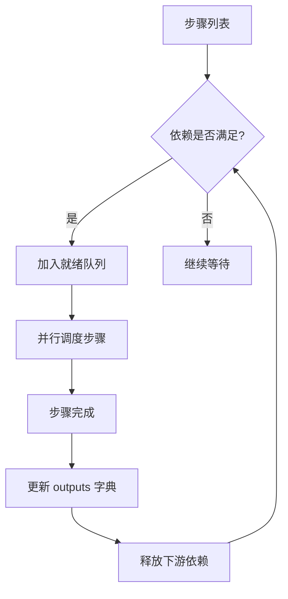
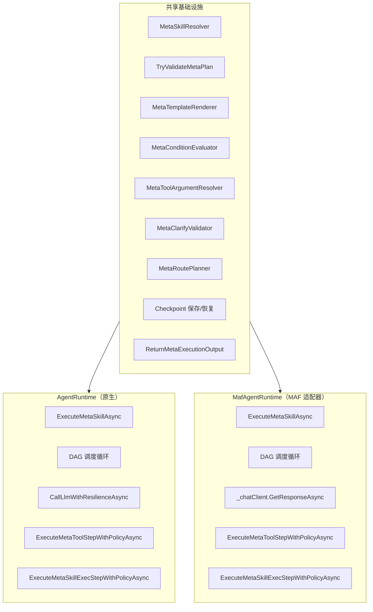
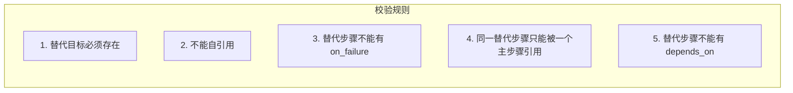
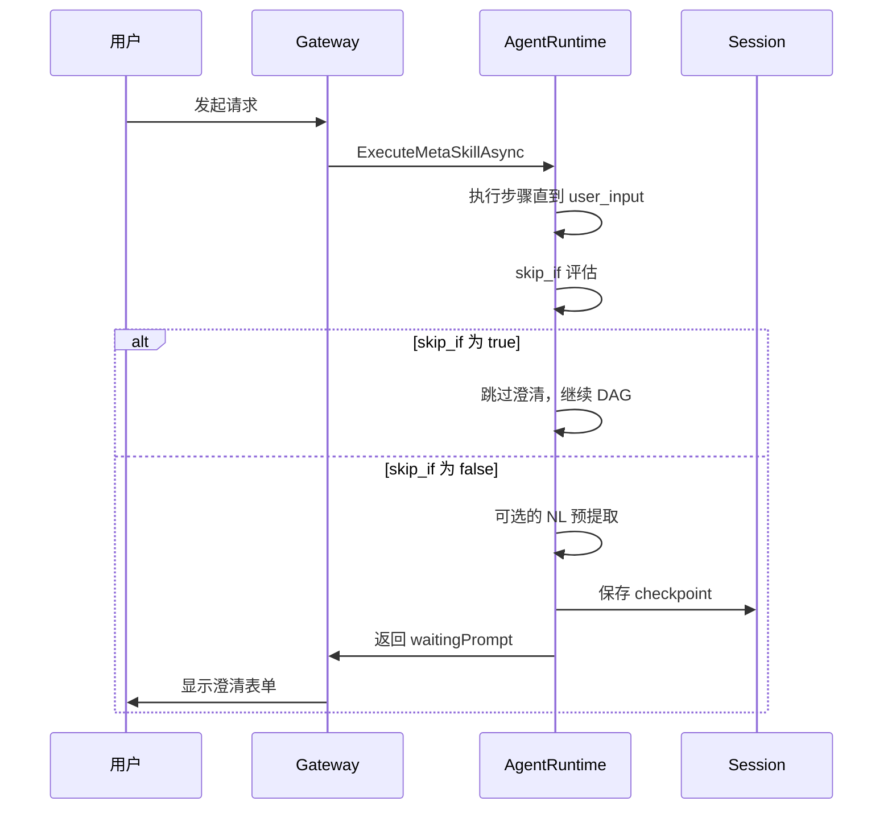
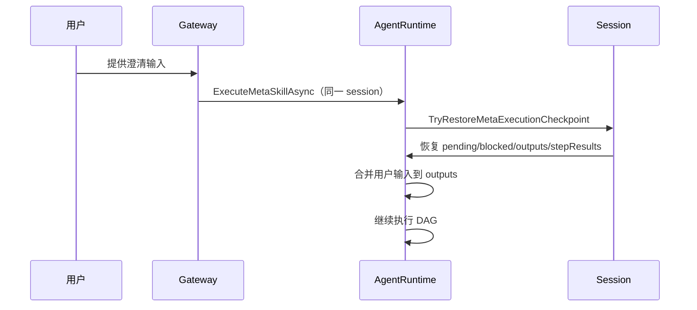
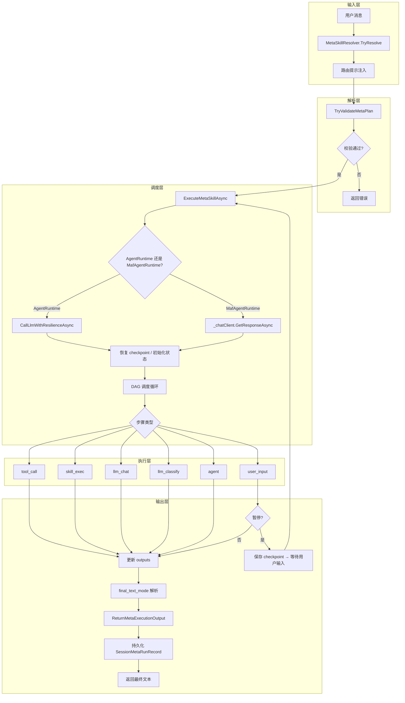

# MetaSkill 编排架构

MetaSkill 是 OpenClaw.NET 将多个 Skill —— 以及任意 LLM/工具调用 —— 组合为多步骤、依赖感知执行计划的机制。与普通 Skill 注入 system prompt 并让 Agent 自行决策不同，MetaSkill 声明一个显式的步骤 DAG，每个步骤带有特定的执行类型，编排器以并行调度、容错和人工介入暂停来驱动该计划完成。

> 参考：完整功能概览见 [`meta-skills.md`](meta-skills.md)，用户指南见 [`meta-skill-user-guide.md`](../meta-skill-user-guide.md)。

---

## 核心类型系统

MetaSkill 子系统建立在一组不可变类型之上，这些类型为解析器、调度器、执行器和持久层之间提供了编译时契约。所有模块通过 `SkillModels.cs` 中定义的 frozen record/class 进行通信。

### MetaSkillStepDefinition —— 执行 DAG 的基本单元

每个步骤代表执行 DAG 中的一个节点，包含以下关键字段：

| 字段 | 类型 | 说明 |
| --- | --- | --- |
| `Id` | `string` | 计划内唯一标识 |
| `Kind` | `string` | 步骤执行类型（`agent`、`llm_chat`、`llm_classify`、`tool_call`、`skill_exec`、`user_input`） |
| `Skill` | `string?` | 委托的 Skill 名称（`agent` / `skill_exec` 类型需要） |
| `Tool` | `string?` | 委托的工具名称（`tool_call` 类型需要） |
| `DependsOn` | `IReadOnlyList<string>` | 上游依赖步骤 ID 列表，构成 DAG 边 |
| `When` | `string?` | Jinja 条件表达式，控制步骤是否执行 |
| `Routes` | `IReadOnlyList<MetaRouteDefinition>` | 条件路由定义，支持分支到其他步骤 |
| `OutputChoices` | `IReadOnlyList<string>` | 分类步骤的允许输出值集合 |
| `ToolAllowlist` | `IReadOnlyList<string>` | 工具访问白名单 |
| `OnFailure` | `string?` | 失败时的替代步骤 ID |
| `TimeoutSeconds` | `int?` | 步骤级超时 |
| `Retry` | `MetaStepRetryPolicy` | 重试策略（`MaxAttempts` + `BackoffMs`） |
| `Clarify` | `MetaClarifySchema?` | 用户输入澄清表单定义 |
| `OutputContract` | `MetaStepOutputContract` | 步骤输出校验契约（`Format` + `RequiredProperties`） |
| `SkillExecEntrypoint` / `SkillExecArgs` / `SkillExecParseMode` | 多种 | `skill_exec` 子进程执行的入口点、参数和输出解析模式 |

### SkillDefinition —— Skill 的完整运行时表示

`SkillDefinition` 是加载完成的 Skill 定义，其中与 MetaSkill 直接相关的字段包括：

- `Kind`: 值为 `SkillKind.Meta` 时标识为 MetaSkill
- `Triggers`: 自然语言触发短语列表
- `MetaPriority`: MetaSkill 匹配优先级
- `FinalTextMode`: 最终文本模式（`auto`、`raw`、`structured`、`step:<id>`）
- `Composition`: `MetaSkillComposition` 实例，包含步骤列表和组合级 `ToolArgsJson`

### MetaClarifySchema —— 澄清表单定义

`user_input` 步骤使用 `Clarify` 定义交互式表单：

```yaml
clarify:
  mode: form              # chat 或 form
  nl_extract: true        # 是否启用 NL 预提取
  fields:                 # 表单字段列表
    - name: topic
      type: string
      required: true
      min_length: 3
    - name: priority
      type: enum
      options: [low, medium, high]
      default: "medium"
  cancel_words: [cancel, 取消]
  timeout_seconds: 300
  skip_if: "outputs.auto_approve == '1'"
```

支持的字段类型：`string`、`enum`、`integer`、`boolean`。每个字段可配置必填、默认值、枚举选项、最小/最大长度、数值上下界。

### 辅助类型

| 类型 | 说明 |
| --- | --- |
| `MetaRouteDefinition` | 条件路由，包含 `When`（Jinja 表达式）和 `To`（目标步骤 ID） |
| `MetaStepRetryPolicy` | 重试策略：`MaxAttempts`（含首次尝试）、`BackoffMs`（重试间隔） |
| `MetaStepOutputContract` | 输出验证契约：`Format`（`text` / `json`）、`RequiredProperties` |
| `MetaExecutionContext` | 执行上下文：持有 `input` 和 `outputs` 字典，供模板渲染使用 |
| `MetaStepExecutionResult` | 单步执行结果：`StepId`、`Kind`、`Status`、`FailureCode`、`ElapsedMs`、`Continued` |

---

## 计划解析与 DAG 校验

在开始执行之前，解析器将 `SKILL.md` 的 `composition` 块转换为经过验证的步骤定义列表。校验分为多个层面，确保到达调度器时计划已被证明是无环的、内部一致且自包含的。

### 解析管线

```
SKILL.md (YAML frontmatter)
  → SkillLoader 解析 composition.steps
    → 每个 step 构建 MetaSkillStepDefinition
      → TryValidateMetaPlan() DAG 结构校验
        → 通过 → 进入 ExecuteMetaSkillAsync 调度循环
        → 失败 → 返回结构化错误
```

### 结构校验规则

`TryValidateMetaPlan` 执行以下校验（位于 `AgentRuntime.cs`）：

1. **唯一 ID**：每个步骤的 `Id` 必须在计划内唯一
2. **Kind 有效性**：`Kind` 必须为六种支持类型之一
3. **Skill 引用**：`agent` / `skill_exec` 类型的步骤必须声明 `skill` 且引用的 Skill 存在
4. **依赖引用**：`depends_on` 中的每个 ID 必须引用计划内的其他步骤
5. **无环校验**：检测 DAG 中的循环依赖（拓扑排序实现）
6. **OnFailure 校验**（5 条工程约束）：
   - 替代步骤目标必须存在
   - 步骤不能自引用
   - 替代步骤不能有 `on_failure`（禁止链式）
   - 同一替代步骤只能被一个主步骤引用
   - 替代步骤不能有 `depends_on`
7. **MetaSkill 嵌套禁止**：MetaSkill 不能委托到另一个 MetaSkill（`TryValidateMetaPlan` 拒绝 `kind: meta` 的委托 Skill）
8. **Route 目标校验**：`routes` 中的 `to` 字段必须引用计划内存在的步骤

```csharp
// 位于 AgentRuntime.cs
if (!TryValidateMetaPlan(steps, LoadedSkills, out var validationError))
    return ReturnMetaExecutionOutput(session, metaSkill,
        finalText: null, stepResults: [],
        validationError, preserveCheckpoint: false);
```

### 模板渲染

步骤中的 `with`、`tool_args` 和 `when` 字段支持 Jinja 模板语法。模板通过 `MetaTemplateRenderer` 渲染，使用 `Jinja2.NET` 引擎，支持 OpenSquilla 兼容的过滤器：`xml_escape`、`slugify`、`truncate`、`tojson`。

模板可访问的上下文变量：

- `{{ input }}`：用户原始输入
- `{{ outputs.<step_id> }}`：已完成步骤的输出
- `{{ inputs.workspace_dir }}`：工作区目录路径

---

## 步骤执行类型

编排器根据 `Kind` 分发到六种不同的执行路径。每种类型的执行成本、工具访问能力和行为契约各不相同。这种设计允许计划编写者为每个步骤选择最低成本的执行器，而非默认为完整子 Agent。

| Kind | 执行方法 | 工具访问 | LLM 调用 | 成本 | 适用场景 |
| --- | --- | --- | --- | --- | --- |
| `agent` | 委托到其他 Skill 指令 | ✅ 完整 | ✅ 多轮 | 最高 | 开放式推理与综合分析 |
| `llm_classify` | 强制返回闭集合中的标签 | ❌ | ✅ 单次 | 最低 LLM | 路由分类器 |
| `llm_chat` | 有界 LLM 生成 | ❌ | ✅ 单次 | 低 LLM | 有界综合，不产生工具调用 |
| `tool_call` | 直接工具调用 | ✅ 直接 | ❌ | 最低 | 确定性副作用（memory_save、文件写入） |
| `skill_exec` | 子进程执行 | ✅ 子进程 | ❌ | 低 | CLI 包装的 Skill 执行 |
| `user_input` | 暂停等待人工输入 | ❌（可选 NL 提取） | ❌ | 暂停开销 | 人工介入澄清表单 |

### `agent` —— 完整子 Agent

`agent` 是默认类型，通过注入被引用 Skill 的 `SKILL.md` 指令作为 system prompt 来生成完整 Agent 响应。该类型允许模型进行多轮推理和工具调用。

### `llm_classify` —— 约束分类

强制模型从 `output_choices` 中返回恰好一个标签。用于路由和分流场景：

```yaml
- id: classify
  kind: llm_classify
  output_choices: [BUG, FEATURE, QUESTION]
  with:
    text: "{{ input | truncate(512) }}"
```

### `llm_chat` —— 有界生成

执行单次 LLM 调用进行有界综合，不产生工具循环。适用于摄入规范化、紧凑起草或轻量级综合。

### `tool_call` —— 直接工具执行

完全绕过 LLM，直接调用已注册的工具处理程序，参数经过 Jinja 渲染。`tool_allowlist` 限制可访问的工具范围，`metadata.capabilities` 提供额外的能力级别门控。

### `skill_exec` —— 子进程执行

运行 Skill 声明的 `entrypoint` 清单作为子进程。支持 `json`、`text`、`lines` 三种解析模式。参数通过模板渲染后传入。

### `user_input` —— 人工介入暂停

暂停 DAG 执行，收集结构化的用户输入。详见[用户输入暂停与恢复](#用户输入暂停与恢复)章节。

---

## DAG 调度器

调度器是执行引擎的核心。它按拓扑顺序消费步骤列表，将每个就绪步骤作为独立任务调度，为无共享依赖的步骤创造真正的并行执行。

### 并行调度机制



调度器维持以下运行时状态：

| 状态 | 说明 |
| --- | --- |
| `pending` | 尚未完成执行的步骤 ID 集合 |
| `blocked` | 被条件路由或失败分支阻塞的步骤 ID 集合 |
| `outputs` | 步骤 ID → 输出文本的字典 |
| `failureAliases` | 失败替代映射（原始步骤 ID → 替代步骤 ID） |
| `stepResults` | 累积的步骤执行结果列表 |
| `dependentsByStep` | 反向依赖索引（步骤 → 依赖它的下游步骤集合） |

### 工具步骤波次并行

`TryExecuteParallelToolWaveAsync` 识别所有依赖已满足的独立 `tool_call` 步骤，在同一次调度中并行执行它们。这优化了需要多个独立工具调用的场景。

### 条件路由

`MetaRoutePlanner` 在步骤完成后评估 `routes`。匹配的路由条件会阻塞不符合条件的下游路径，确保执行流向正确的分支：

```yaml
- id: classify
  kind: llm_classify
  output_choices: [BUG, FEATURE]
  routes:
    - when: "outputs.classify == 'BUG'"
      to: fix_bug
    - when: "outputs.classify == 'FEATURE'"
      to: design_feature
```

### 运行时共享

DAG 引擎在 `AgentRuntime`（原生）和 `MafAgentRuntime`（Microsoft Agent Framework 适配器）之间共享——二者以相同方式执行 MetaSkill。所有等价测试在两个运行时上均通过。详见[双运行时架构](#双运行时架构)章节。

---

## 双运行时架构

OpenClaw.NET 在两个独立的运行时上实现 MetaSkill 执行，二者共享相同的 DAG 调度器核心、相同的校验管线和相同的辅助基础设施——但在模型驱动的步骤类型（`agent`、`llm_chat`、`llm_classify`）中调用 LLM 的方式不同。

### 架构图



### 共享部分

两个运行时共享同一 `IAgentRuntime` 接口，并委托给以下基础设施的相同实现：

| 组件 | 位置 | 共享？ |
| --- | --- | --- |
| 触发器解析 | `MetaSkillResolver.TryResolve` | ✅ 相同 |
| 计划校验 | `TryValidateMetaPlan` | ✅ 相同 |
| DAG 调度循环 | `while (pending.Count > 0)` 状态机 | ✅ 相同逻辑，独立副本 |
| 模板渲染 | `MetaTemplateRenderer`（Jinja2.NET） | ✅ 相同 |
| 条件求值 | `MetaConditionEvaluator` | ✅ 相同 |
| 工具参数解析 | `MetaToolArgumentResolver` | ✅ 相同 |
| 澄清校验 | `MetaClarifyValidator` | ✅ 相同 |
| 路由规划 | `MetaRoutePlanner` | ✅ 相同 |
| Checkpoint 保存/恢复 | `SaveMetaExecutionCheckpoint` / `TryRestoreMetaExecutionCheckpoint` | ✅ 相同 |
| 审计持久化 | `ReturnMetaExecutionOutput` → `SessionMetaRunRecord` | ✅ 相同 |
| 工具调用 | `ExecuteMetaToolStepWithPolicyAsync`（通过 `OpenClawToolExecutor`） | ✅ 相同 |
| 子进程执行 | `ExecuteMetaSkillExecStepWithPolicyAsync` | ✅ 相同 |

### 差异点：LLM 调度

两个运行时在调用 LLM 处理模型驱动的步骤类型时存在分歧。这是**唯一**的架构差异：

| 步骤类型 | AgentRuntime（原生） | MafAgentRuntime（MAF） |
| --- | --- | --- |
| `agent` | `ExecuteMetaLlmStepWithPolicyAsync` → `CallLlmWithResilienceAsync` | `ExecuteMetaChatStepWithPolicyAsync` → `_chatClient.GetResponseAsync` |
| `llm_chat` | `ExecuteMetaLlmStepWithPolicyAsync` → `CallLlmWithResilienceAsync` | `ExecuteMetaChatStepWithPolicyAsync` → `_chatClient.GetResponseAsync` |
| `llm_classify` | `ExecuteMetaLlmStepWithPolicyAsync` → `CallLlmWithResilienceAsync` | `ExecuteMetaChatStepWithPolicyAsync` → `_chatClient.GetResponseAsync` |
| `tool_call` | 相同（通过 `OpenClawToolExecutor`） | 相同（通过 `OpenClawToolExecutor`） |
| `skill_exec` | 相同（`ExecuteMetaSkillExecStepWithPolicyAsync`） | 相同（`ExecuteMetaSkillExecStepWithPolicyAsync`） |
| `user_input` | 相同的 checkpoint 逻辑 | 相同的 checkpoint 逻辑 |

### AgentRuntime LLM 路径

原生运行时通过自己的弹性包装器调用 LLM：

```csharp
// AgentRuntime.cs — llm_chat / llm_classify / agent 调度
var llmResult = await ExecuteMetaLlmStepWithPolicyAsync(
    step,
    token => CallLlmWithResilienceAsync(session, messages, options, turnCtx, token),
    ct);
```

`CallLlmWithResilienceAsync` 直接针对配置的 LLM 提供商处理重试、熔断和提供商级错误恢复。

### MafAgentRuntime LLM 路径

MAF 适配器通过 Microsoft Agent Framework 的 `IChatClient` 调用 LLM：

```csharp
// MafAgentRuntime.cs — llm_chat / llm_classify / agent 调度
var response = await ExecuteMetaChatStepWithPolicyAsync(
    step,
    token => _chatClient.GetResponseAsync(messages, options, token),
    ct);
```

`_chatClient` 是 `MafExecutionServiceChatClient`，封装了 MAF AI 管线，提供中间件、遥测和流式支持。重试和熔断由 `ExecuteMetaChatStepWithPolicyAsync` 处理，其结构与 `ExecuteMetaLlmStepWithPolicyAsync` 镜像。

### 构造函数注入

两个运行时在构造时通过 `OpenClawToolExecutor` 的 `metaInvokeExecutor` 回调注入 MetaSkill 执行能力：

```csharp
// AgentRuntime.cs
_metaSkillsEnabled = context.SkillsConfig?.MetaSkill.Enabled ?? true;
toolExecutor = new OpenClawToolExecutor(
    ...,
    metaInvokeExecutor: (session, skillName, input, token)
        => ExecuteMetaSkillAsync(session, skillName, input, token));

// MafAgentRuntime.cs — 相同模式
_metaSkillsEnabled = context.SkillsConfig?.MetaSkill.Enabled ?? true;
_toolExecutor = new OpenClawToolExecutor(
    ...,
    metaInvokeExecutor: (session, skillName, input, token)
        => ExecuteMetaSkillAsync(session, skillName, input, token));
```

当模型调用 `meta_invoke` 工具时，`OpenClawToolExecutor` 路由到运行时特定的 `ExecuteMetaSkillAsync`，后者再调用各自运行时的 LLM 调度方法处理模型驱动的步骤。

### 等价性保证

所有 MetaSkill 执行路径均由 `MafAdapterTests.cs` 和 `AgentRuntimeTests.cs` 中的等价测试覆盖。测试套件验证对于相同的 MetaSkill 计划和输入，两个运行时产生相同的 `stepResults`、`outputs`、`final_text` 和 `SessionMetaRunRecord` 条目。

---

## 失败处理

### OnFailure 替代步骤

当步骤失败时（超时、工具错误、校验失败、LLM 异常），调度器首先检查该步骤是否声明了 `on_failure` 替代步骤。如果有，替代步骤被调度执行，其输出镜像到失败步骤的输出槽——下游 `depends_on` 链接保持满足。

```yaml
- id: primary_search
  kind: tool_call
  tool: web_search
  on_failure: fallback_search

- id: fallback_search
  kind: tool_call
  tool: local_search
```

### ContinueOnError

`with.continue_on_error` 控制错误传播行为：

- `false`（默认）：步骤失败 → 终止整个 DAG，返回错误
- `true`：步骤失败 → 记录失败结果，继续执行后续步骤

### 5 条工程约束



这些约束在解析时和运行时双重校验。

### 失败传播

如果步骤失败且没有 `on_failure` 替代步骤，且 `continue_on_error` 为 `false`，调度器终止 DAG，返回 `MetaStepExecutionResult` 列表和错误信息。

---

## 用户输入暂停与恢复

`user_input` 步骤类型通过暂停/恢复协议实现跨轮次人工交互。

### 暂停流程



1. **skip_if 评估**：如果 `skip_if` Jinja 表达式对当前上下文求值为真，步骤被视为成功完成的透传（空输出），下游依赖保持满足
2. **NL 预提取**：当 `nl_extract: true` 且 LLM 可用时，编排器对可用上下文执行单次 LLM 提取，高置信度提取的字段合并到初始表单值中
3. **Checkpoint 保存**：`pending`、`blocked`、`outputs`、`stepResults` 完整保存到 Session
4. **暂停**：返回 `waitingPrompt` 给用户界面

### 恢复流程



恢复时，`TryRestoreMetaExecutionCheckpoint` 从 Session 重建完整执行状态。已完成的步骤不会重新执行。用户输入合并到 `outputs` 中，DAG 从暂停点继续。

### 超时处理

如果 `timeout_seconds` 到期且用户未提供输入：

1. 步骤标记为 `user_input_timeout` 失败
2. 如果声明了 `on_failure`，激活替代步骤
3. 如果没有替代步骤，DAG 终止并返回错误

---

## 触发器匹配与软激活

MetaSkill 通过两层触发器系统激活：确定性子串匹配层和软激活提示注入层。

### 确定性匹配

`MetaSkillResolver.TryResolve` 扫描所有 MetaSkill 的 `triggers` 列表，对用户消息执行不区分大小写的子串匹配。按 `meta_priority` 降序、触发短语长度降序选择最佳匹配。

```csharp
// 位于 MetaSkillResolver.cs
public static bool TryResolve(
    IReadOnlyList<SkillDefinition> skills,
    string? userMessage,
    out SkillDefinition? matched)
```

### 路由提示注入

当确定性匹配存在时，运行时通过 `BuildMetaRoutingSuffix` 在 system prompt 中注入路由提示，引导模型优先调用 `meta_invoke` 工具，防止模型绕过匹配的 MetaSkill 直接回答。

```text
[Meta Routing Hint]
A matching meta skill is available. Prefer calling tool `meta_invoke` before other tools.
Matched skill: weekly-report
Use arguments JSON: {"skill":"<matched-skill-name>","input":"<user-request>"}.
If invocation fails, continue with normal tool planning.
[/Meta Routing Hint]
```

### 策略门控

`SkillsConfig.MetaSkill.Enabled` 可在网关级别禁用 MetaSkill 调用。禁用时：
- MetaSkill 保持加载（用于库存检查和历史查看）
- 不在 prompt 索引中暴露
- `meta_invoke` 执行被拒绝
- 不注入路由提示

---

## 持久化与审计追踪

### SessionMetaRunRecord

每次 MetaSkill 执行完成后，`ReturnMetaExecutionOutput` 方法记录一条 `SessionMetaRunRecord`：

```csharp
// 位于 AgentRuntime.cs ReturnMetaExecutionOutput
session.MetaRunRecords.Add(new SessionMetaRunRecord
{
    SkillName = metaSkill.Name,
    StartedAtUtc = ...,
    FinishedAtUtc = ...,
    Status = ...,
    StepResults = stepResults,
    FinalText = finalText,
    Error = error
});
```

### 审计记录字段

| 字段 | 说明 |
| --- | --- |
| `SkillName` | MetaSkill 名称 |
| `StartedAtUtc` / `FinishedAtUtc` | 执行开始/结束时间 |
| `Status` | 运行状态（`ok`、`failed`、`paused`、`cancelled`） |
| `StepResults` | 每步执行结果（耗时、失败码、状态） |
| `FinalText` | 最终用户可见文本 |
| `Error` | 终止错误信息 |
| `PlanDigest` | 计划摘要（用于变更检测） |

### CLI 审计命令

```sh
# 列出会话的运行记录
openclaw skills meta-runs <session-id>

# 查看详细运行记录
openclaw skills meta-runs <session-id> --run <run-id> --verbose

# JSON 格式输出
openclaw skills meta-runs <session-id> --json

# 回放预览
openclaw skills meta-runs replay <session-id> --run <run-id>

# 审计重建（不重新执行）
openclaw skills meta-runs reconstruct <session-id> --run <run-id>
```

---

## 最终文本解析

DAG 成功完成后，编排器根据计划的 `final_text_mode` 设置解析用户可见的最终文本。

| 模式 | 行为 | 适用场景 |
| --- | --- | --- |
| `auto`（默认） | LLM 后处理 `step_outputs` 为简短 Markdown 摘要 | 通用计划，最后步骤产生原始数据或 JSON |
| `raw` | 返回最后一个非替代步骤的输出原文 | 最后步骤已产出 Markdown 报告 |
| `structured` | 返回步骤状态、失败码和输出的结构化 JSON | 自动化消费、诊断 |
| `step:<id>` | 返回 `outputs[step_id]` 原文 | 特定交付步骤非最后步骤时使用 |

### structured 模式

`structured` 模式返回包含完整执行信息的结构化 JSON：

```json
{
  "status": "ok",
  "final_text": "...",
  "step_results": [
    {
      "step_id": "fetch",
      "kind": "tool_call",
      "status": "completed",
      "elapsed_ms": 234
    }
  ]
}
```

当 MetaSkill 被禁用或执行失败时，structured 模式返回对应的错误结构（`policy_disabled`、`validation_failed` 等），便于自动化消费者处理。

---

## 有界执行

四层超时保护确保 MetaSkill 执行始终有界：

| 层级 | 机制 | 说明 |
| --- | --- | --- |
| 1. 每步超时 | `TimeoutSeconds` + `CancellationToken` | 步骤级超时，超时后触发 `on_failure` 或终止 |
| 2. 每步重试 | `Retry.MaxAttempts` + `Retry.BackoffMs` | 失败后自动重试，带退避延迟 |
| 3. 会话合约 | `ContractPolicy.MaxRuntimeSeconds` | 网关级运行时上限 |
| 4. Agent 循环 | `maxIterations` + 熔断器 | 防止 Agent 步骤无限循环 |

---

## 架构总结



整个编排管线从输入经过解析、触发器匹配、DAG 调度、按类型执行、最终文本解析，再到持久化——`user_input` 步骤有暂停/恢复的旁路。每个子系统通过 `SkillModels.cs` 中定义的类型进行通信，确保解析器、调度器、执行器和持久层共享单一编译时契约。

### 关键设计原则

1. **依赖注入**：`AgentRuntime` 和 `MafAgentRuntime` 均通过构造函数注入 `metaInvokeExecutor`，使整个系统可独立测试
2. **双运行时共享核心**：DAG 引擎、校验管线和辅助基础设施在 `AgentRuntime` 和 `MafAgentRuntime` 之间共享。仅 LLM 调度路径不同 —— `CallLlmWithResilienceAsync` vs `_chatClient.GetResponseAsync` —— 等价测试保证行为一致
3. **安全优先**：`tool_allowlist` + `metadata.capabilities` + `MetaSkill.Enabled` 三重门控
4. **失败即停**：默认在错误时终止，`continue_on_error` 和 `on_failure` 提供显式的容错路径
5. **完整审计**：每次执行留下可回放、可重建的审计轨迹

---

[功能概览](meta-skills.md) · [用户指南](../meta-skill-user-guide.md) · [编写指南](../authoring/meta-skills.md) · [迁移说明](../opensquilla-meta-skill-migration.md) · [站点地图](../SITE_MAP.md)
